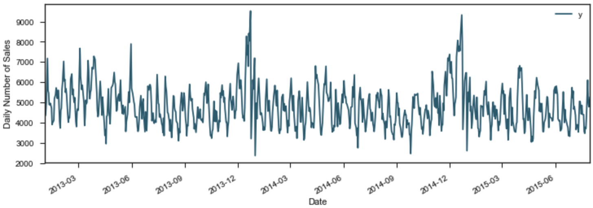
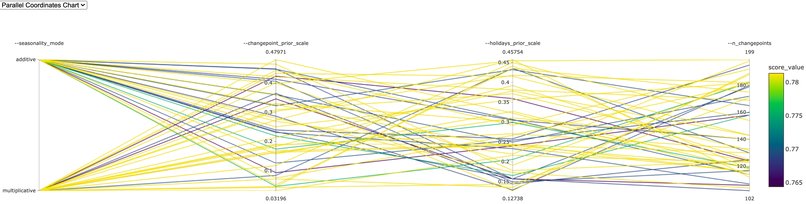
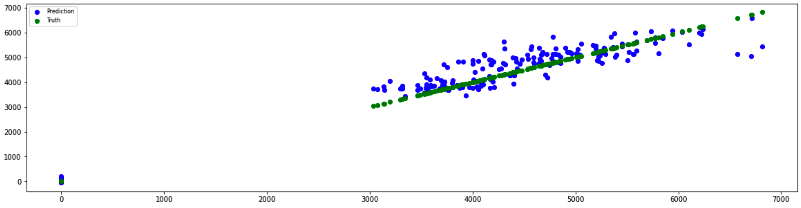

# Azure Machine Learning Engineer

This is the graduation project from Udacity Nanodegree program "Machine Learning Engineer with Microsoft Azure". 

The approach is leveraging both Azure Auto ML and HyperDrive features to search for the best model in order to predict time-series based sales for each store operated by Rossmann in European countries.

The best model will be deployed and hosted on Azure Container Instance for production consumption. It will be available as REST API endpoint where any type of applications can sent HTTP requests to and receive back predictions.

## Project Set Up and Installation

1. Install Anaconda: https://docs.anaconda.com/anaconda/install
   
2. Check out the latest code to a folder on local computer:

    `git clone https://github.com/elbertsoftware/ML-Engineering.git`


3. Create new conda environment using provided [`environment.yaml`](environment.yaml):
    
    `conda env create -f environment.yaml`
   
4. Navigate to the project folder and activate the newly created environment:
   
    `conda activate udacity_azureml`

5. Create new Azure Machine Learning workspace if needed and download its `config.json` to the project folder:
    
    

## Dataset

### Overview
The dataset used in this project was originated from a Kaggle competition (https://www.kaggle.com/c/rossmann-store-sales):

Rossmann operates over 3,000 drug stores in 7 European countries. Currently, Rossmann store managers are tasked with predicting their daily sales for up to six weeks in advance. Store sales are influenced by many factors, including promotions, competition, school and state holidays, seasonality, and locality. With thousands of individual managers predicting sales based on their unique circumstances, the accuracy of results can be quite varied.

The historical sales data for 1,115 Rossmann stores. The task is to forecast the "Sales" column for the test set. Note that some stores in the dataset were temporarily closed for refurbishment.

### Files

1. train.csv - historical data including Sales
2. forecast.csv - historical data excluding Sales
3. store.csv - supplemental information about the stores

### Data fields
Most of the fields are self-explanatory. The following are descriptions for those that aren't.

1. Id - an Id that represents a (Store, Date) duple within the test set
2. Store - a unique Id for each store
3. Sales - the turnover for any given day (this is what you are predicting)
4. Customers - the number of customers on a given day
5. Open - an indicator for whether the store was open: 0 = closed, 1 = open
6. StateHoliday - indicates a state holiday. Normally all stores, with few exceptions, are closed on state holidays. Note that all schools are closed on public holidays and weekends. a = public holiday, b = Easter holiday, c = Christmas, 0 = None
7. SchoolHoliday - indicates if the (Store, Date) was affected by the closure of public schools
8. StoreType - differentiates between 4 different store models: a, b, c, d
9. Assortment - describes an assortment level: a = basic, b = extra, c = extended
10. CompetitionDistance - distance in meters to the nearest competitor store
11. CompetitionOpenSince[Month/Year] - gives the approximate year and month of the time the nearest competitor was opened
12. Promo - indicates whether a store is running a promo on that day
13. Promo2 - Promo2 is a continuing and consecutive promotion for some stores: 0 = store is not participating, 1 = store is participating
14. Promo2Since[Year/Week] - describes the year and calendar week when the store started participating in Promo2
15. PromoInterval - describes the consecutive intervals Promo2 is started, naming the months the promotion is started anew. E.g. "Feb,May,Aug,Nov" means each round starts in February, May, August, November of any given year for that store


### Exploratory Data Analysis

Enhance the dataset with the following additional fields:

```
# data extraction
train['Year'] = train.index.year
train['Month'] = train.index.month
train['Day'] = train.index.day
train['WeekOfYear'] = train.index.weekofyear

# adding new variable
train['SalePerCustomer'] = train['Sales']/train['Customers']
```

**ECDF (Empirical Cumulative Distribution Function):**

To get the first impression about continious variables in the data we can plot ECDF:


About 20% of data has zero amount of sales/customers that we need to deal with and almost 80% of time daily amount of sales was less than 1000. So what about zero sales, is it only due to the fact that the store is closed?

**Missing values:**

Closed stores and zero sales stores:


There're 172817 closed stores in the data. It is about 10% of the total amount of observations. To avoid any biased forecasts we will drop these values.

What about opened stores with zero sales?


Interestingly enough, there are opened store with no sales on working days. There're only 54 days in the data, so we can assume that there were external factors involved, for example manifestations.

Store data has missing CompetitionDate which can be imputed by the median value which is twice less than the average:


For store data without Promo2, we can assume there is no promotion by setting zero to those:


**Store types:**

In this section we will closely look at different levels of StoreType and how the main metric Sales is distributed among them:


StoreType B has the highest average of Sales among all others, however we have much less data for it. So let's print an overall sum of Sales and Customers to see which StoreType is the most selling and crowded one:


Clearly stores of type A. StoreType D goes on the second place in both Sales and Customers. What about date periods?


**Correlational Analysis:**

There is a strong positive correlation between the amount of Sales and Customers of a store. We can also observe a positive correlation between the fact that the store had a running promotion (Promo equal to 1) and amount of Customers:


However, as soon as the store continues a consecutive promotion (Promo2 equal to 1) the number of Customers and Sales seems to stay the same or even decrease, which is described by the pale negative correlation on the heatmap. The same negative correlation is observed between the presence of the promotion in the store and the day of a week:


There are several things here:

1. In case of no promotion, both Promo and Promo2 are equal to 0, Sales tend to peak on Sunday. Though we should note that StoreType C doesn't work on Sundays. So it is mainly data from StoreType A, B and D.

2. On the contrary, stores that run the promotion tend to make most of the Sales on Monday. This fact could be a good indicator for Rossmann marketing campaigns. The same trend follows the stores which have both promotions at the same time (Promo and Promo2 are equal to 1).

3. Promo2 alone doesn't seem to be correlated to any significant change in the Sales amount. This can be also prooved by the blue pale area on the heatmap above.

**Conclution:**

1. The most selling and crowded StoreType is A.

2. The best "Sale per Customer" StoreType D indicates to the higher Buyer Cart. We could also assume that the stores of this types are situated in the rural areas, so that customers prefer buying more but less often.

3. Low SalePerCustomer amount for StoreType B indicates to the possible fact that people shop there essentially for small things. Which can also indicate to the label of this store type - "urban" - as it's more accessible for public, and customers don't mind shopping there from time to time during a week.

4. Customers tend to buy more on Mondays when there's one promotion running (Promo) and on Sundays when there is no promotion at all (both Promo and Promo2 are equal to 0).

5. Promo2 alone doesn't seem to be correlated to any significant change in the Sales amount.

### Time-Series Analysis per Store Type

What makes a time series different from a regular regression problem?

The basic assumption of a linear regression that the observations are independent while time-series data is time dependent. Along with an increasing or decreasing trend, most time series have some form of seasonality trends, i.e. variations specific to a particular time frame. For example, for Christmas holidays, which we will see in this dataset.

**Seasonality:**

We take four stores from store types to represent their group:

1. Store number 2 for StoreType A
2. Store number 85 for StoreType B,
3. Store number 1 for StoreType C
4. Store number 13 for StoreType D.

then show their weekly graph in the same order:


Retail sales for StoreType A and C tend to peak for the Christmas season and then decline after the holidays. We might have seen the same trend for StoreType D (at the bottom) but there is no information from July 2014 to January 2015 about these stores as they were closed.

**Yearly trend:**


Overall sales seems to increase, however not for the StoreType C (a third from the top). Even though the StoreType A is the most selling store type in the dataset, it seems that it can follow the same decreasing trajectory as StoreType C did.

**Autocorrelaion:**

The next step in our time series analysis is to review Autocorrelation Function (ACF) and Partial Autocorrelation Function (PACF) plots:

1. ACF: is a measure of the correlation between the timeseries with a lagged version of itself. For instance at lag 5, ACF would compare series at time instant ‘t1’ … ’tn’ with series at instant ‘t1-5’ … ’tn-5’ (t1-5 and tn being end points).

2. PACF: on the other hand, is a measures of the correlation between the time series with a lagged version of itself but after eliminating the variations explained by the intervening comparisons. Eg. at lag 5, it will check the correlation but remove the effects already explained by lags 1 to 4.


We can read these plots horizontally. Each horizontal pair is for one 'StoreType', from A to D. In general, those plots are showing the correlation of the series with itself, lagged by x time units correlation of the series with itself, lagged by x time units.

There is at two things common for each pair of plots: non randomnes of the time series and high lag-1 (which will probably need a higher order of differencing d/D):

1. Type A and type B: Both types show seasonalities at certain lags. For type A, it is each 12th observation with positives spikes at the 12 (s) and 24(2s) lags and so on. For type B it's a weekly trend with positives spikes at the 7(s), 14(2s), 21(3s) and 28(4s) lags.

2. Type C and type D: Plots of these two types are more complex. It seems like each observation is coorrelated to its adjacent observations.

### Task

After experimenting Azure Auto ML on multiple stores, there are limitations on the execution time and predictive result, I decided to apply machine learning algorithms for one store this time for simplicity. Based on the above analytic, store 1 of type C represents most common scenarios of the domain problem:



The Core Data Science team at Facebook had published a new procedure for forecasting time series data called Prophet. It is based on an additive model where non-linear trends are fit with yearly and weekly seasonality, plus holidays.

1. Experiment 1:  Use Azure Auto ML capability on sub dataset of store 1 to find the best model performance in predicting daily sales for up to six weeks in advance.

2. Experiment 2: Use Prophet to build model on the same sub dataset, then leverages Azure Hyperdrive capability to find the best hyperparameters for the model

3. Model Comparison: Compare different performance metrics found by experiment 1 and 2 in order to select the best model to be productionized

4. Deployment: Register the best model to Azure and deploy it as Web Service endpoint on Azure Container Instance (ACI)

5. Production: Use forecast dataset to make predictions via the Web Service endpoint

### Access

The data files were downloaded into the `./data` folder. The notebook `1_automl_impl.ipynb` will:

1. loads the data files into 2 datasets: train and forecast
2. filter for store 1 sub datasets: train and forecast
3. split the train dataset into training and test sets at 2015-01-01
4. build holidays on store 1 which will be used in experiment 2
5. upload and register train, test, holiday, and forecast datasets to Azure datastore in order to reuse them in both experiment 1 and 2:

```
train = Dataset.get_by_name(ws, name='sales_train1').to_pandas_dataframe()
test = Dataset.get_by_name(ws, name='sales_test1').to_pandas_dataframe()
forecast = Dataset.get_by_name(ws, name='sales_forecast1')
holiday = Dataset.get_by_name(ws, name='sales_holiday1').to_pandas_dataframe()
```

## Automated ML

### AutoML Configuration

1. Create a model training compute cluster with 4 nodes, each node is a CPU base compute with 4 cores, 14GB RAM, and 28GB storage

2. Use time-series based forecasting models, except ARIMA and Prophet since they do not support the dataset structure

3. Do not engage Deep Learning modeling algorithms

4. Primary metric: Optimize model performance by Normalized Root Mean Squared Error (NRMSE) in order to find the best model

5. Use 5 folds (n_cross_validation) in cross validation: 4 folds for training and 1 fold for testing

6. Utilize 4 nodes in the training cluster with all cores possible

7. Run experiment for 30 minutes

8. Target column is 'Sales' in the datasets

9. Forecast 6 weeks in the future

### Results

The best model is the GradientBoosting algorithm with the smallest NRMSE = 0.10629:


and best hyperparameters:

1. `alpha`: 0.1
2. `ccp_alpha`: 0.0
3. `criterion`: mse
4. `learning_rate`: 0.1
5. `loss`: ls
6. `max_depth`: 6
7. `max_features`: 0.6
8. `max_leaf_nodes`: None
9. `min_impurity_decrease`: 0.0
10. `min_samples_leaf`: 0.00286
11. `min_samples_split`: 0.00753
12. `min_weight_fraction_leaf`: 0.0
13. `n_estimators`: 50
14. `subsample`: 0.8
15. `tol`: 0.0001
16. `validation_fraction`: 0.1

The model accuracy can be improved by tuning the following settings:

1. `max_depth`: Depth of each tree is very important because each tree in boosting technique learns from the errors of the previous trees. Hence underfitting the initial trees ensure that the later trees learn actual patterns and not noise.

2. `learning_rate`: Learning rate gives weights to previous trees according to a value between 0 and 1. Lower learning rates give lesser importance to previous trees. Higher weights lead to faster steps towards optimization. Lower weights typically lead to global optimum. But lower learning rates need more trees to learn the function.

3. `subsample`: if the value is less than 1 a subset of variables is used to build the tree making it robust and learn signal from more variables. This variable reduces overfitting by not fitting only 1 variable but a group of variables.

## Hyperparameter Tuning

Previously I analized time-series data on soil salinity using classic S/ARIMA. In this project, I would like try out the modern algorithm Prophet. It is a new procedure for forecasting time series. It is based on both additive and multiplicative modelings where non-linear trends are fit with yearly and weekly seasonality, plus holidays. It enables performing automated forecasting which are already implemented at scale in Python 3.

### Parameter Sampling

Define the method used to navigate the hyperparamter space. In this case, the RandomParameterSampling class is selected since its random sweep implementation not only performs essentially as well as grid search but also take much less time. The following hyperparameters helps in optimizing the prophet model:

1. Changepoints:

    * `n_changepoints`: is the number of change happen in the data. Prophet model detects them by its own. By default, its value is 25, which are uniformly placed in the first 80% of the time series. Changing n_changepoints can add value to the model.

    * `changepoint_prior_scale`: to indicate how flexible the changepoints are allowed to be. In other words, how much can the changepoints fit to the data. The higher it is, the more flexible it could be, but it could end up overfitting. By default, this parameter is set to 0.05

2. Seasonality (`seasonality_mode`): there are 2 types model seasonality mode: Additive and Multiplicaticative. By default Prophet fits additive seasonalities, meaning the effect of the seasonality is added to the trend to get the forecast. Prophet can model multiplicative seasonality.

3. Holiday prior scale (`holiday_prior_scale`): just like changepoint_prior_scale, holiday_prior_scale is used to smoothning the effect of holidays. By default its value is 10, which provides very little regularization. Reducing this parameter dampens holiday effects.

```
param_sampling = RandomParameterSampling({
    '--seasonality_mode': choice('multiplicative', 'additive'),
    '--changepoint_prior_scale': uniform(0.01, 0.5),
    '--holidays_prior_scale': uniform(0.1, 0.5),
    '--n_changepoints': choice(range(100, 200))
})
```

### Early Termination Policy

Define rules to terminate poorly performing runs in order to improves running time and computational efficiency. The Bandit policy is used since it helps eleminate poor runs quicker. With slack_factor = 0.1 and delay_evaluation = 5, the policy guarantees any run after the 5th interval whose metric is less than (1 / (1 + 0.1) or 91% of the current best performing run will be terminated.

```
early_termination_policy = BanditPolicy(
    slack_factor=0.1, 
    evaluation_interval=1, 
    delay_evaluation=5
)
```

### Scikit-Learn Estimator

Declare where to find the custom training module `./script/train.py`, what is the target compute along with dependences needed to execute a run: 

```
estimator = SKLearn(
    source_directory=os.path.join('.', 'script'), 
    entry_script='train.py',
    compute_target=compute_target,
    pip_packages=['pystan', 'fbprophet']
)
```

### Metrics and Optimizing Goal

Since the training module uses `r2_score` as the primary metrics to score model performance, the HyperDrive needs to maximize the same metric.

```
hyperdrive_config = HyperDriveConfig(
    estimator=estimator,
    hyperparameter_sampling=param_sampling,
    policy=early_termination_policy,
    primary_metric_name='score_value',
    primary_metric_goal=PrimaryMetricGoal.MAXIMIZE,
    max_total_runs=50,
    max_concurrent_runs=max_nodes)
```

### Prophet Modeling

A model of Prophet will be fitted by the train dataset from Azure along with hyperparameters generated by RandomParameterSampling from Hyperdrive run:

```
model = Prophet(
    changepoint_prior_scale=args.changepoint_prior_scale,
    holidays_prior_scale=args.holidays_prior_scale,
    n_changepoints=args.n_changepoints,
    seasonality_mode=args.seasonality_mode,
    weekly_seasonality=True,
    daily_seasonality=True,
    yearly_seasonality=True,
    holidays=holiday,
    interval_width=0.95
)

model.fit(train)
```

Then it will be used to make predictions on the same time span as test dataset:

```
test_forecast = model.make_future_dataframe(
    periods=(test['ds'].max() - test['ds'].min()).days + 1,
    freq='D',
    include_history=False
)

test_predictions = model.predict(test_forecast)
test_predictions = test_predictions[['ds', 'yhat']]
```

Finally we use coefficient of determination score function `r2_score` to compare predictive values against the truth:

```
score_value = r2_score(test_df['y'], test_predictions['yhat'])
```

### Results

The Hyperdrive run completed in 25 minutes after examining 50 combinations of these 4 hyperparameters as configured:


The best hyperparameters are:

1. `changepoint_prior_scale`: 0.03196
2. `holidays_prior_scale`: 0.21653
3. `n_changepoints`: 123
4. `seasonality_mode`: multiplicative


Random Parameter search space:



Top 10 child runs:


The Prophet model accuracy can be improved by tuning the following settings:

1. Country/region holidays: If we can obtain what are the 7 countries Rossmann operates in, we can tell Prophet to use the knowledge.

2. Extend the search ranges of these 4 hyperparamters

3. Use different score functions, such as `mean_absolute_percentage_error` or `normalized_root_mean_squared_error`

4. Increase number of runs

5. Enable Deep Learning algorithms

## Experiment Comparison

Use test dataset to make predictions from both models obtained by experient 1 (Auto ML approach) and experiment 2 (Hyperdrive tunning) then compare the predictions with the truth:


   
Visualizing predictions vs. truth also tell the experiment 1 outperformed the experiment 2:

1. Experiment 1:



2. Experiment 2:


## Model Deployment

So far the best model from Auto ML approach is stored in the run, we need to make it available for wider use by registering it with Azure ML platform:

```
model = remote_run.register_model(model_name=experiment_name, description=experiment_name)
```

For the sake of this prototype, Azure Container Instance (ACI) should be sufficient, we will deploy the model to ACI and make it available as Web Service endpoint along with Application Insights enabled:

```
inference_config = InferenceConfig(
    environment=best_run.get_environment(), 
    entry_script=f'{train_folder}/{experiment_name}_scoring.py'
)

aci_config = AciWebservice.deploy_configuration(
    cpu_cores=1, 
    memory_gb=2,
    enable_app_insights=True
)

aci_service_name = f'{experiment_name}_forecast'.replace('_', '-')
aci_service = Model.deploy(ws, aci_service_name, [model], inference_config, aci_config)

aci_service.wait_for_deployment(True)
aci_service.state
```


**Test Production Model Endpoint:**

After deploying the model into production, as the development team, we can test the endpoint by using a simple Python script to serialize forecast dataset into JSON, send it off to the service, and retrieve the predictions back:

```
# retrieve forecast dataset and convert it to Pandas dataframe
X_query = forecast_dataset.to_pandas_dataframe()

# convert datetime to string, because Timestamps cannot be serialized to JSON.
X_query[time_column_name] = X_query[time_column_name].astype(str)

# The Service object accept the complex dictionary, which is internally converted to JSON string.
# The section 'data' contains the data frame in the form of dictionary.
forecast_sample = json.dumps({'data': X_query.to_dict(orient='records')})
response = aci_service.run(input_data=forecast_sample)

# translate from networkese to datascientese
try: 
    res_dict = json.loads(response)
    y_fcst_all = pd.DataFrame(res_dict['index'])
    y_fcst_all[time_column_name] = pd.to_datetime(y_fcst_all[time_column_name], unit='ms')
    y_fcst_all['Forecast'] = res_dict['forecast']    
except:
    print(res_dict)
```


## Production Model Consumption

With model capability available as REST endpoints, making predictions is just simple as sending HTTP POST requests to its endpoint along with predictors as inputs, the predictions are sent back as HTTP POST responses. Any application can leverage the model.

**Open API Documentation:**

Swagger is the standardized way to document REST API in the industry. It provides universally recognized web interface to show endpoints inputs, outputs, and how to use them.

Azure generates API documentation for every deployed model in JSON format. It can be viewed in Swagger UI

* Access Swagger document in Azure: Navigate to `Endpoints` section of Azure Machine Learning Studio and select the newly deployed endpoint under `Real-time endpoints` tab. The Swagger URL to download the document should be available in the `Details` tab:

    
    

* Download Swagger document: Use `curl` CLI tool to save it as JSON file `swagger.json` to the sub folder `swagger` of the project folder:

    `curl http://3e6071ca-ef64-43af-b5f6-07f66e5b72a2.westus.azurecontainer.io/swagger.json --output swagger.json`

* Start Swagger UI: It is a docker container. Run the provided convenient Bash script `swagger.sh` on terminal:

    `./swagger.sh`

* Start serve.py: In order to feed the JSON file to the Swagger UI, a little Python code is needed to bypass CORS restriction from Azure. Run the provided `serve.py` on terminal:

    `python serve.py`

* Examine APIs: Users of the production model can explore the API details by navigate to Swagger UI and learn about how input and output JSONs look like:

    

**API Consumption:**

* Obtain API score URL from Azure: Navigate to the same place where `Swagger URL` is then click on `Consume` tab and copy the `REST endpoint`:

    

* Make predictions: We gonna use Postman to send HTTP requests the endpoint but they can be sent from any typ of applications:

    

## Screen Recording

*TODO* Provide a link to a screen recording of the project in action. Remember that the screencast should demonstrate:

- A working model
- Demo of the deployed model
- Demo of a sample request sent to the endpoint and its response

## Credits:

1. [Elena Petrova](https://github.com/datageekette): for her data analysis:
   
   https://github.com/datageekette/rossmann_TSA_forecasts/blob/master/Rossmann_Sales.ipynb

2. [Manorama](https://www.kaggle.com/manovirat): for her suggestion on Prophet tuning parameters:
   
   https://www.kaggle.com/elenapetrova/time-series-analysis-and-forecasts-with-prophet
